# PolyDub Architecture

## System Overview

Two independent processes must run simultaneously:

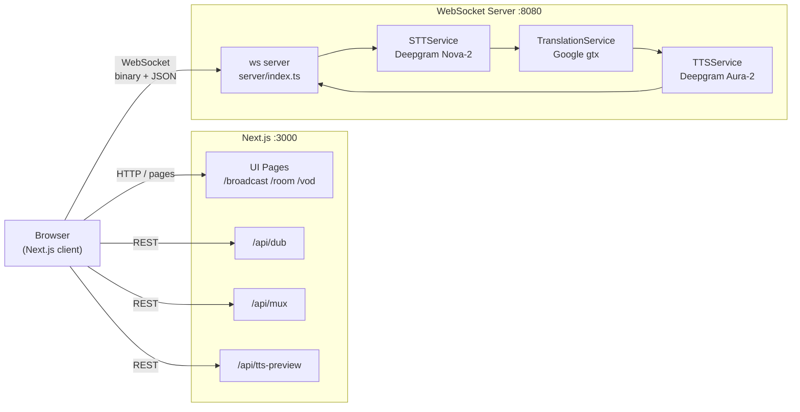

The Next.js app handles UI and REST routes. The WebSocket server owns all real-time audio — it holds long-lived Deepgram streaming connections that cannot run inside serverless functions.

---

## WebSocket Role Routing

Every WebSocket connection declares its role via a query param on connect. The server branches on arrival:

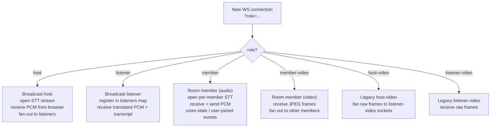

---

## Broadcast Flow

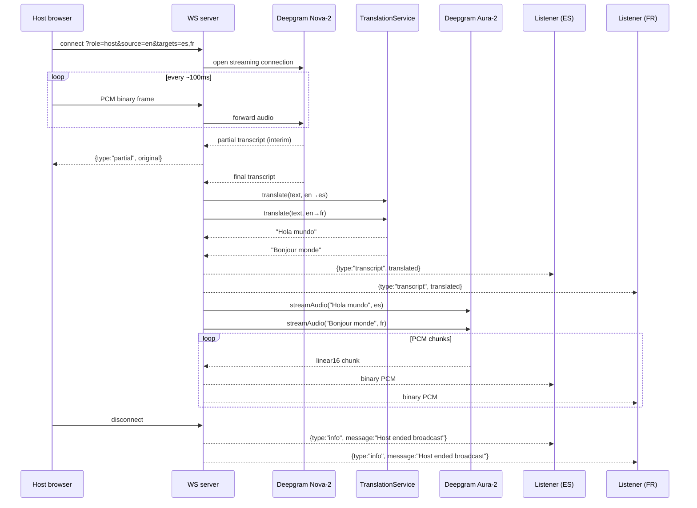

---

## Room Flow

Each member has two sockets: one for audio/control, one for video.

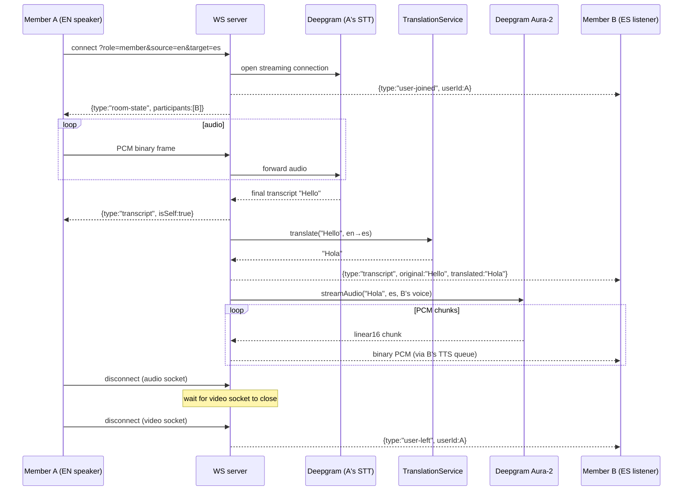

### Per-listener TTS Queue

Prevents audio interleaving when multiple speakers talk simultaneously:

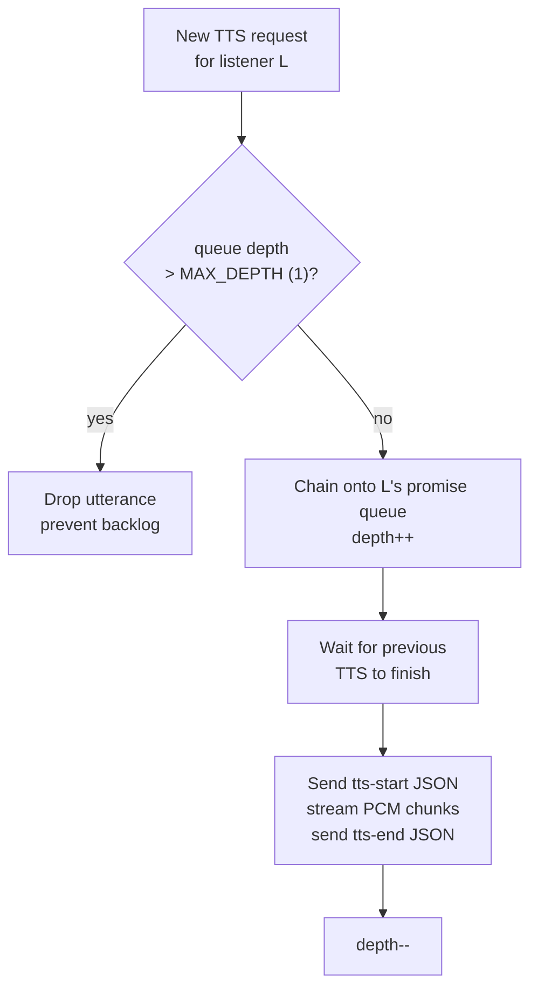

### Room Video

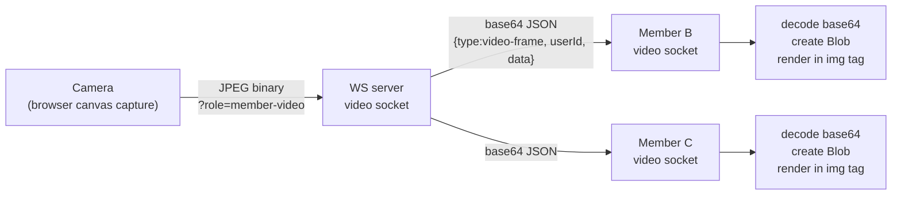

---

## VOD Pipeline

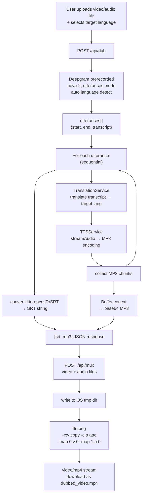

---

## STT Service (`server/stt.ts`)

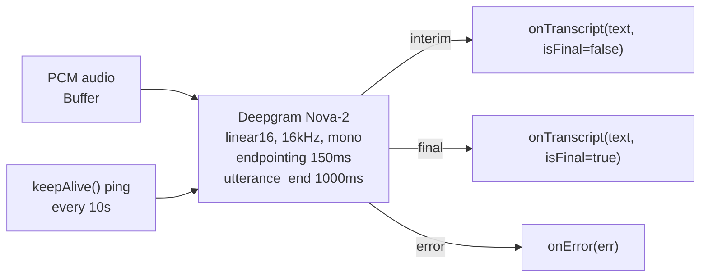

- Language: explicit tag, or `en-US` fallback when source is `auto`
- Detected language returned via `alternative.languages[0]` when available

---

## Translation Service (`server/translate.ts`)

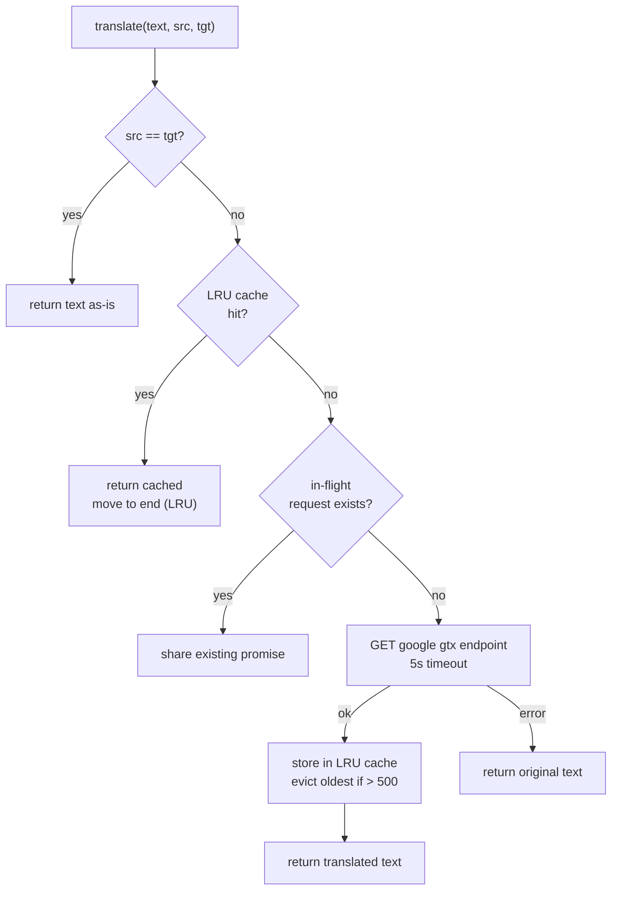

---

## TTS Service (`server/tts.ts`)

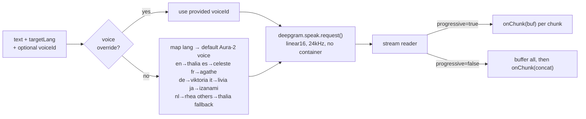

---

## Browser Audio Playback (`hooks/use-room.ts`)

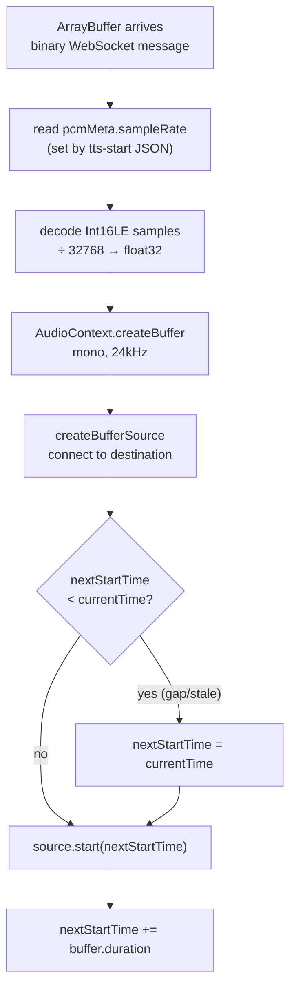

Chunks scheduled this way play back gapless even when they arrive in bursts.

---

## Environment Variables

| Variable | Used by | Purpose |
|---|---|---|
| `DEEPGRAM_API_KEY` | WS server + `/api/dub` | STT and TTS |
| `LINGO_API_KEY` | Build-time Lingo compiler | UI locale compilation |
| `NEXT_PUBLIC_WS_URL` | Browser hooks | WebSocket server address |
| `PORT` / `WEBSOCKET_PORT` | WS server | Listening port (default 8080) |
