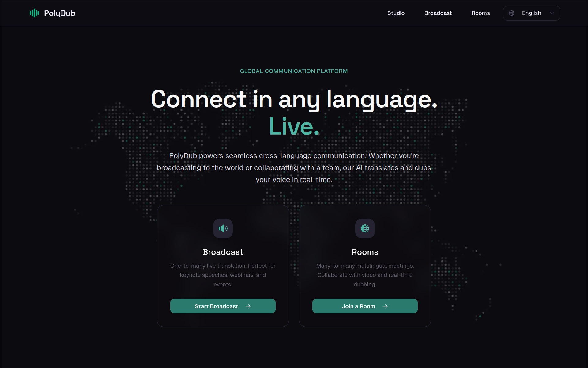
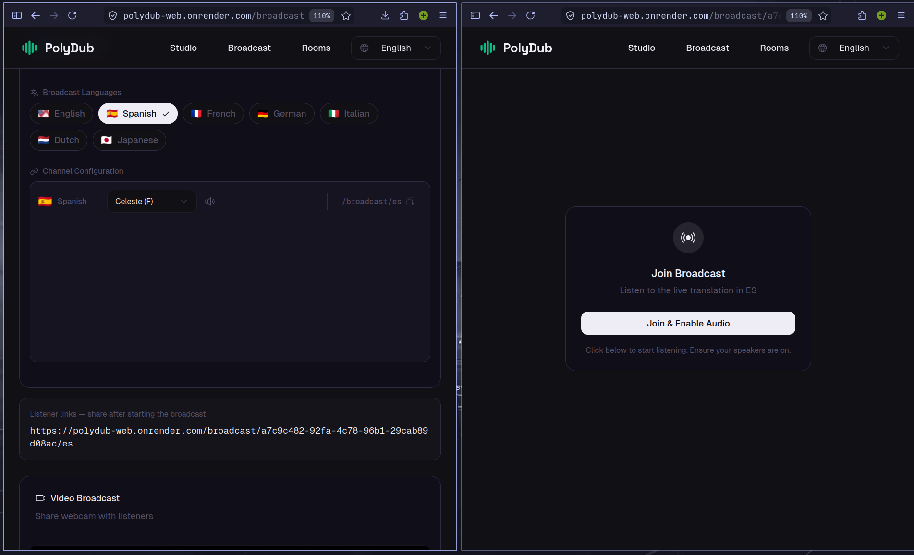

# PolyDub

> Real-time multilingual video dubbing and communication platform powered by AI

[](https://nextjs.org/)
[](https://www.typescriptlang.org/)
[](https://lingo.dev/)
[](https://deepgram.com/)

**DEMO:** https://youtu.be/JiXxj8-gv-A

## 🌐 Overview

PolyDub is a cutting-edge platform that breaks down language barriers in real-time communication. Whether you're broadcasting to a global audience or collaborating in multilingual meetings, PolyDub translates and dubs speech instantly, preserving your natural voice while speaking to listeners in their native language.

### ✨ Key Features

- **🎙️ Real-Time Translation**: Speak in your language, and your audience hears you in theirs—instantly
- **🎬 Broadcast Mode**: One-to-many live translation perfect for webinars, keynotes, and events
- **👥 Room Mode**: Many-to-many multilingual video meetings with real-time dubbing
- **🗣️ Natural Voice Synthesis**: AI-powered text-to-speech with Deepgram Aura voices
- **🌍 15+ Languages**: Support for English, Spanish, French, German, Italian, Dutch, Japanese, Portuguese, Hindi, Arabic, Korean, Turkish, Vietnamese, Polish, Ukrainian, and Chinese
- **📹 Video Support**: Optional webcam streaming alongside audio translation
- **📝 Live Transcription**: Real-time transcripts in both source and target languages
- **⚡ Low Latency**: Optimized WebSocket pipeline for minimal delay

## 📸 Screenshots


### Landing Page

*Hero section with multilingual interface*

### Broadcast Mode

*Live broadcasting interface with real-time translation*

### Room Mode

*Multi-participant video room with language selection*

## 🏗️ Tech Stack

### Frontend
- **Framework**: Next.js 16.1 (React 19.2)
- **Language**: TypeScript 5
- **Styling**: Tailwind CSS 4.1
- **UI Components**: Radix UI primitives
- **Icons**: Phosphor Icons
- **Internationalization**: Lingo.dev Compiler

### Backend
- **Runtime**: Node.js with WebSockets (ws)
- **Translation**: Lingo.dev SDK
- **Speech-to-Text**: Deepgram STT
- **Text-to-Speech**: Deepgram Aura TTS
- **Real-time Communication**: WebSocket Server

### Infrastructure
- **Deployment**: Vercel (frontend), Custom (WebSocket server)
- **Analytics**: Vercel Analytics

## 🚀 Getting Started

### Prerequisites

- Node.js 18+ and pnpm
- [Deepgram API Key](https://console.deepgram.com/) for STT/TTS
- [Lingo.dev API Key](https://lingo.dev/) for translation

### Installation

1. **Clone the repository**
   ```bash
   git clone https://github.com/yourusername/polydub.git
   cd polydub
   ```

2. **Install dependencies**
   ```bash
   pnpm install
   ```

3. **Configure environment variables**
   ```bash
   cp .env.example .env
   ```
   
   Edit `.env` and add your API keys:
   ```env
   DEEPGRAM_API_KEY=your_deepgram_api_key_here
   LINGO_API_KEY=your_lingo_api_key_here
   WEBSOCKET_PORT=8080
   NEXT_PUBLIC_WS_URL=ws://localhost:8080
   ```

4. **Generate translations** (first-time setup)
   ```bash
   pnpm build
   ```
   
   This will extract translatable content and generate translation files for all supported languages.

### Development

Run both the Next.js dev server and WebSocket server:

```bash
# Terminal 1: Next.js frontend
pnpm dev

# Terminal 2: WebSocket server
pnpm server
```

The application will be available at:
- Frontend: `http://localhost:3000`
- WebSocket server: `ws://localhost:8080`

### Production Build

```bash
# Build the frontend
pnpm build

# Start the production server
pnpm start

# Start the WebSocket server
pnpm server
```

## 📖 Usage

### Broadcast Mode

1. Navigate to `/broadcast`
2. Select your source language (what you'll speak)
3. Select target language(s) for your audience
4. Click "START" to begin broadcasting
5. Share the listener URL with your audience
6. Audience members click the URL, select audio output, and hear you in their language

### Room Mode

1. Navigate to `/rooms`
2. Create a new room or join an existing one with a Room ID
3. Configure your audio settings:
   - **Source language**: What you'll speak
   - **Target language**: What you want to hear others in
4. Enable video (optional)
5. Start communicating with other participants

### Language Selection

Change the UI language using the language switcher in the header. The entire interface supports 15+ languages with automatic translation.

## 🏛️ Architecture

```
┌─────────────────┐
│   Next.js App   │
│   (Frontend)    │
└────────┬────────┘
         │ HTTP/WS
         ▼
┌─────────────────┐
│  WebSocket      │
│  Server         │
└────┬───────┬────┘
     │       │
     ▼       ▼
┌─────────┐ ┌──────────┐
│Deepgram │ │Lingo.dev │
│STT/TTS  │ │Translation│
└─────────┘ └──────────┘
```

### Key Components

- **Frontend** (`app/`, `components/`)
  - Landing page and navigation
  - Broadcast and Room interfaces
  - Video/audio capture and playback
  - Real-time transcription display

- **Backend** (`server/`)
  - WebSocket server for real-time communication
  - Speech-to-text processing
  - Translation service integration
  - Text-to-speech generation

- **Translation System** (`src/lingo/`)
  - Lingo.dev compiler integration
  - Multi-language UI translations
  - Runtime translation cache

## 🔧 Configuration

### Supported Languages

Configure target languages in `next.config.mjs`:

```javascript
export default withLingo(nextConfig, {
  sourceLocale: "en",
  targetLocales: ["es", "fr", "de", "it", "nl", "ja", "pt", "hi", "ar", "ko", "tr", "vi", "pl", "uk", "zh"]
});
```

### Voice Customization

TTS voices can be customized per language in the language selector component. Deepgram Aura provides multiple voice options for natural-sounding speech.

## 🛠️ Development Guide

### Project Structure

```
polydub/
├── app/                    # Next.js app router pages
│   ├── broadcast/          # Broadcast mode pages
│   ├── room/              # Room mode pages
│   ├── rooms/             # Room lobby
│   ├── api/               # API routes
│   └── lingo/             # Translation metadata
├── components/            # React components
│   ├── polydub/          # Core feature components
│   ├── room/             # Room-specific components
│   └── ui/               # UI primitives
├── server/               # WebSocket server
│   ├── index.ts         # Main server
│   ├── stt.ts           # Speech-to-text service
│   ├── tts.ts           # Text-to-speech service
│   └── translate.ts     # Translation service
├── src/lingo/           # Translation cache
└── public/              # Static assets
```

### Adding New Languages

1. Add the language code to `targetLocales` in `next.config.mjs`
2. Run `pnpm build` to generate translations
3. Translation files will be created in `src/lingo/cache/`

### WebSocket Events

The WebSocket server handles these event types:
- `start-broadcast` - Begin broadcasting audio
- `join-broadcast` - Listen to a broadcast
- `create-room` / `join-room` - Room management
- `audio` - Audio data streaming
- `video` - Video frame streaming

## 📄 License

This project is licensed under the MIT License - see the LICENSE file for details.
