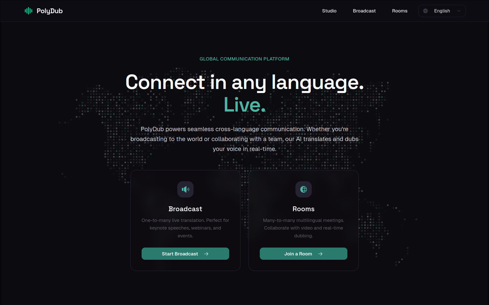
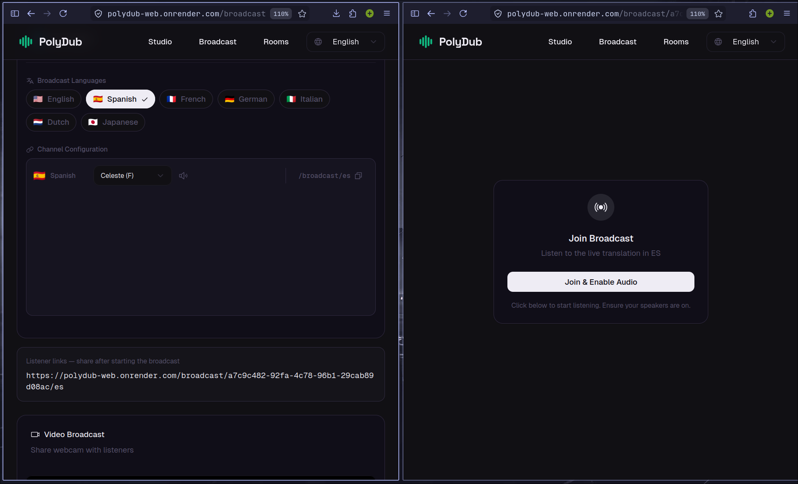
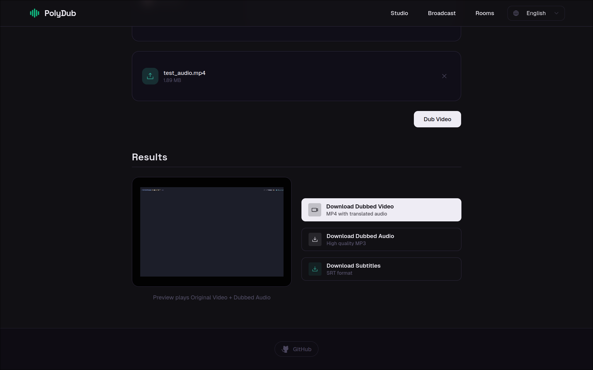
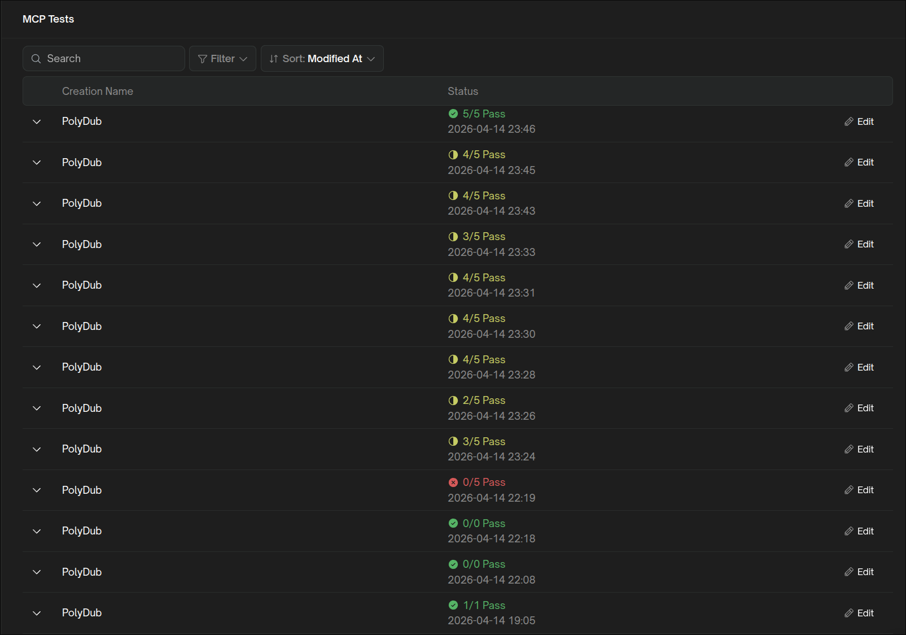

# PolyDub: Real-Time Multilingual Video Dubbing

> Speak any language. Be heard in any language. Live.

[](https://nextjs.org/)
[](https://react.dev/)
[](https://www.typescriptlang.org/)
[](https://deepgram.com/)
[](https://lingo.dev/)

PolyDub is a browser-based multilingual dubbing platform for live broadcasts, video rooms, and uploaded media. It captures speech, transcribes it with Deepgram, translates it, generates dubbed speech, and plays it back to listeners in their selected language.

## Features

| Mode | Route | What it does |
| --- | --- | --- |
| Live Broadcast | `/broadcast`, `/broadcast/[id]/[lang]` | One host speaks while listeners receive translated transcripts and dubbed audio. |
| Multilingual Rooms | `/rooms`, `/room/[roomId]` | Multiple participants speak in their own language and hear others in their selected language. |
| VOD Dubbing | `/vod` | Upload media and generate dubbed audio, SRT subtitles, and a muxed MP4. |

**Highlights:**

- Low-latency browser dubbing target for live speech.
- Native Aura-2 voice options for English, Spanish, French, German, Italian, Japanese, and Dutch.
- Per-listener TTS queues so generated room audio does not interleave across speakers.
- English + 11 translated UI locales compiled at build time with Lingo.dev.
- VOD pipeline for prerecorded transcription, translation, TTS audio, SRT generation, and FFmpeg muxing.

## Screenshots

### Landing Page


### Broadcast Mode


### Multilingual Room


### VOD Dubbing Studio


## How It Works

See [ARCHITECTURE.md](./ARCHITECTURE.md) for sequence diagrams, WebSocket role routing, and pipeline details.

```text
Mic PCM -> WebSocket
  -> Deepgram Nova-2 STT
  -> Google Translate gtx adapter
  -> Deepgram Aura-2 TTS
  -> WebSocket -> Browser AudioContext -> Speaker
```

PolyDub runs as two cooperating processes:

```text
Next.js app (:3000)
  - /broadcast
  - /broadcast/[id]/[lang]
  - /rooms
  - /room/[roomId]
  - /vod
  - /api/dub
  - /api/mux
  - /api/tts-preview

WebSocket server (:8080)
  - broadcast hosts and listeners
  - room audio and video sockets
  - Deepgram streaming STT
  - translation cache and in-flight deduplication
  - Deepgram streaming TTS
```

## Supported Languages

**Live/VOD source language options:** English, Spanish, French, German, Italian, Dutch, Japanese, Portuguese, Hindi, Arabic, Korean, Turkish, Vietnamese, Ukrainian, and Polish.

**Aura-2 target voices exposed in the UI:**

| Language | Voices |
| --- | --- |
| English | Thalia, Andromeda, Apollo, Arcas |
| Spanish | Celeste, Estrella, Nestor, Sirio |
| French | Agathe, Hector |
| German | Viktoria, Elara, Julius, Fabian |
| Italian | Livia, Melia, Dionisio, Elio |
| Japanese | Izanami, Uzume, Ama, Ebisu, Fujin |
| Dutch | Rhea, Beatrix, Sander, Lars |

## Tech Stack

- **App**: Next.js 16, React 19, TypeScript
- **UI**: Tailwind CSS v4, shadcn-style UI primitives, Radix UI, Phosphor Icons
- **Realtime**: Node.js, `ws`, browser Web Audio APIs
- **STT**: Deepgram Nova-2 streaming and prerecorded transcription
- **Translation**: Google Translate unofficial `gtx` endpoint with LRU cache and in-flight deduplication
- **TTS**: Deepgram Aura-2
- **VOD muxing**: System `ffmpeg` binary invoked by `/api/mux`
- **UI i18n**: Lingo.dev compiler
- **Testing**: TestSprite-generated backend and frontend tests

## Prerequisites

- Node.js 18 or newer
- pnpm
- A [Deepgram API key](https://console.deepgram.com) for STT and TTS
- A [Lingo.dev API key](https://lingo.dev) for UI translation compilation
- FFmpeg installed and available as `ffmpeg` on `PATH` for production VOD muxing

## Getting Started

```bash
git clone https://github.com/crypticsaiyan/polydub.git
cd polydub
pnpm install
cp .env.example .env
```

Edit `.env`:

```env
DEEPGRAM_API_KEY=your_deepgram_api_key_here
LINGO_API_KEY=your_lingo_api_key_here
LINGO_BUILD_MODE=translate
PORT=8080
WEBSOCKET_PORT=8080
NEXT_PUBLIC_WS_URL=ws://localhost:8080
```

Start both processes in separate terminals:

```bash
pnpm dev
```

```bash
pnpm run server
```

Open [http://localhost:3000](http://localhost:3000).

## Scripts

| Command | Description |
| --- | --- |
| `pnpm dev` | Start the Next.js dev server on `http://localhost:3000`. |
| `pnpm run server` | Start the TypeScript WebSocket server on port `8080`. |
| `pnpm build` | Build the Next.js app and run Lingo compilation. |
| `pnpm start` | Start the built Next.js app. |
| `pnpm server:build` | Compile the WebSocket server TypeScript to `dist-server/`. |
| `pnpm server:start` | Start the compiled WebSocket server from `dist-server/index.js`. |
| `pnpm lint` | Run ESLint. |

## Environment Variables

| Variable | Used by | Required | Description |
| --- | --- | --- | --- |
| `DEEPGRAM_API_KEY` | Next.js API routes, WebSocket server | Yes | Deepgram STT and TTS API key. |
| `LINGO_API_KEY` | Next.js build, `/api/dub` guard | Yes for full build/VOD flow | Mapped to `LINGODOTDEV_API_KEY` in `next.config.mjs` for Lingo.dev compilation. |
| `LINGO_BUILD_MODE` | Next.js build | No | Optional Lingo compiler mode. Defaults to `translate`. |
| `PORT` | WebSocket server | No | Primary WebSocket server port. Defaults to `8080`. |
| `WEBSOCKET_PORT` | WebSocket server | No | Fallback port when `PORT` is not set. |
| `NEXT_PUBLIC_WS_URL` | Browser client | Yes | Public WebSocket URL, for example `ws://localhost:8080` or `wss://your-ws-domain.com`. |

## API Reference

### `POST /api/dub`

Accepts multipart form data and returns generated subtitles plus base64 audio.

| Field | Required | Description |
| --- | --- | --- |
| `file` | Yes | Uploaded audio/video file. |
| `targetLanguage` or `target_language` | Yes | Target language code for dubbing. |
| `sourceLanguage` or `source_language` | No | Source language code. Defaults to `auto`. |
| `voiceId` or `voice_id` | No | Deepgram Aura-2 voice ID override. |

Response:

```json
{
  "srt": "1\n00:00:00,000 --> 00:00:01,500\n...",
  "mp3": "base64-encoded-audio"
}
```

### `POST /api/mux`

Accepts multipart form data and returns a `video/mp4` response.

| Field | Required | Description |
| --- | --- | --- |
| `video` or `original_video` | Yes | Original video file. |
| `audio` or `dubbed_audio` | Yes | Dubbed audio file. |

### `POST /api/tts-preview`

Returns preview audio for a short text/voice sample used by the voice selector UI.


## Project Structure

```text
app/
  broadcast/             Live broadcast host page
  broadcast/[id]/[lang]/ Live broadcast listener page
  room/[roomId]/         Multilingual room page
  rooms/                 Room lobby
  vod/                   VOD dubbing studio
  api/dub/               STT -> translate -> TTS -> SRT/audio
  api/mux/               FFmpeg audio/video muxing
  api/tts-preview/       Voice preview endpoint
components/polydub/      Core product UI components
components/room/         Room video components
components/ui/           Shared UI primitives
hooks/                   WebSocket and responsive UI hooks
lib/srt.ts               SRT subtitle generation
server/                  WebSocket server and Deepgram/translation wrappers
testsprite_tests/        Generated TestSprite tests and reports
```

## Testing

Tests are generated and executed using [TestSprite MCP](https://testsprite.com).

### Initial Round: Issues Found

TestSprite surfaced two concrete bugs on the first run:

1. **TC003 (`POST /api/dub` third-party failure):** The error handler was returning a plain text string on API failures instead of a JSON response. This caused clients to receive an unparseable body on 500 errors.
2. **TC009 (malformed room ID):** The frontend form was submitting malformed room IDs to the server without client-side validation. The server rejected them but no user-visible error was shown.

Both were fixed before Round 2.

### Final Rounds: All Tests Passing



**Backend API Tests (5/5 Passing)**

| Test | What it checks |
| --- | --- |
| TC001 | `POST /api/dub` returns JSON with non-empty `srt` and valid base64 `mp3`. |
| TC002 | `POST /api/dub` missing params returns 400 with `Missing parameters`. |
| TC003 | `POST /api/dub` third-party failure returns 500 with an error body. |
| TC004 | `POST /api/mux` valid video + audio produces a `video/mp4` stream. |
| TC005 | `POST /api/mux` missing inputs returns 400 with `Missing video or audio file`. |

**Frontend / E2E Tests (12 Cases Passing)**

| Test | What it checks |
| --- | --- |
| TC001 | Start live broadcast after selecting source and target languages. |
| TC002 | Create a new room and reach the in-room view. |
| TC003 | Join an existing room by ID. |
| TC004 | Leave and rejoin a room with the same ID. |
| TC005 | Prevent broadcast start when no target languages are selected. |
| TC006 | Change language and voice selection in an active room. |
| TC007 | VOD studio opens in upload-ready state. |
| TC008 | Navigate from landing page to broadcast setup. |
| TC009 | Show validation when joining with a malformed room ID. |
| TC010 | Navigate from landing page to rooms lobby. |
| TC011 | Reject unsupported VOD file type on upload. |
| TC012 | Navigate from landing page to VOD studio. |

Test files are in [testsprite_tests/](./testsprite_tests/). Run artifacts are in [testsprite_tests/tmp/](./testsprite_tests/tmp/).

## License

MIT


